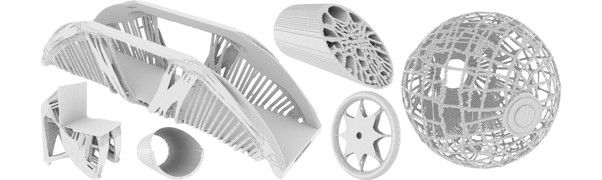

# LETO: Hybrid Lagrangian-Eulerian Method for Topology Optimization
[Yue Li](https://liyuesolo.github.io/)\*, [Xuan Li](https://xuan-li.github.io/)\*, [Minchen Li](https://www.seas.upenn.edu/~minchenl/)\*, [Yixin Zhu](https://yzhu.io/), [Bo Zhu](https://www.dartmouth.edu/~boolzhu/), [Chenfanfu Jiang](https://www.seas.upenn.edu/~cffjiang/) <br>
\* *Equal contributions*

This repo is a MATLAB version of LETO in 2D with linear elasticity. The high-performance and more complete version in C++ will be open sourced later.

[[Paper]](https://arxiv.org/pdf/2003.01215.pdf)
[[Video]](https://www.youtube.com/watch?v=O43tASS9DXQ)

# Implementation
We separate LETO into two files:

```leto.m``` contains LETO's core algorithm (scene setup, density transfer from carrier particles to quadratures, compliance computation, derivative computation and the optimization loop). The scene setup and DOF indices follow the convention of the 88-line [SIMP](http://www.topopt.mek.dtu.dk/Apps-and-software/Efficient-topology-optimization-in-MATLAB).

```mmaUpdate.m``` is a stand-alone optimizer [MMA](https://onlinelibrary.wiley.com/doi/abs/10.1002/nme.1620240207), on which the optimization loop is based. This implementation is tranlated and modifed from an open-source [C++ version](https://github.com/jdumas/mma).

# Usage
```Matlab
leto(nelx, nely, volfrac, penal)
```
```nelx * nely``` defines the simulation resolution.<br>
```volfrac``` defines the volume constraint.<br>
```penal``` defines the power-law used in SIMP.

For different scene setups please feel free to modify the code.

# Results
With this MATLAB implementation we compare LETO with SIMP ([topo88.m](http://www.topopt.mek.dtu.dk/-/media/Subsites/topopt/apps/dokumenter-og-filer-til-apps/top88.ashx?la=da&hash=FF50594C1E8F57D292C705978C3DCA3D7BCEA6B8)) on a beam example. The scene setups are exactly the same.

The Dirichlet and Neumann boundary conditions are defined as (in both ```leto.m``` and ```top88.m```):
```Matlab
F = sparse(2 * (nely + 1) * (nelx + 1), 1, -1, 2*(nely+1)*(nelx+1),1);
fixeddofs = 1:2*nely;
```

We compare SIMP to LETO with the same and half of the resolution:
```Matlab
top88(120, 40, 0.4, 3, 1.5, 1); % SIMP
leto(120, 40, 0.4, 3); % LETO
leto(60, 20, 0.4, 3); % LETO (half res)
```

The result of SIMP (converged with 280 iterations):


The result of LETO (converged with 95 iterations):


The result of LETO with half of the resolution (converged with 111 iterations):


As we can see LETO generates more intricate structures than SIMP with less iteration count using even half of the simulation resolution. With multiple density samples in each cell, LETO effectively achieves sub-cell resolution.
