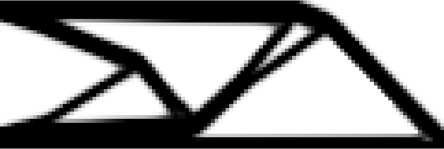
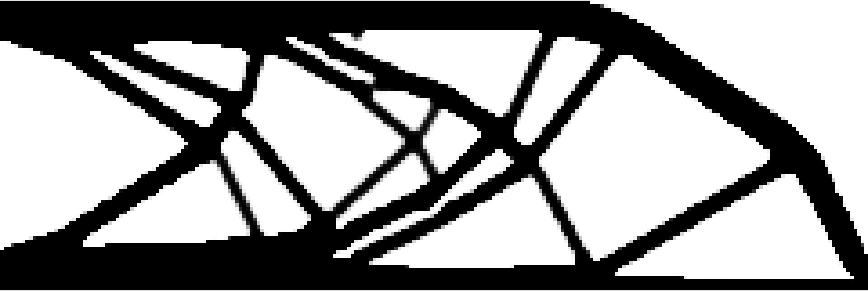

# LETO: Hybrid Lagrangian-Eulerian Method for Topology Optimization
[Yue Li](https://liyuesolo.github.io/)\*, [Xuan Li](https://xuan-li.github.io/)\*, [Minchen Li](https://www.seas.upenn.edu/~minchenl/)\*, [Yixin Zhu](https://yzhu.io/), [Bo Zhu](https://www.dartmouth.edu/~boolzhu/), [Chenfanfu Jiang](https://www.seas.upenn.edu/~cffjiang/) <br>
\* Equal contributions

This repo is a matlab version of LETO, which only contains 2D linear topology optimization to illustate our pipeline. The high-performance version is written in C++ with tbb parallel programming, which may be open source later.

[[Paper]](https://arxiv.org/pdf/2003.01215.pdf)
[[Video]](https://www.youtube.com/watch?v=O43tASS9DXQ)

# Implementation
We separate the LETO into two files. 

```leto.m``` contains scene setup, density transfer from carrier particles to quadratures, compliance computation, derivative computation and the optimization loop. All for loops in our original C++ implementation are vectorized. The scene setup and DOF indices follow the convention used in 88-line [SIMP](http://www.topopt.mek.dtu.dk/Apps-and-software/Efficient-topology-optimization-in-MATLAB).

```mmaUpdate.m``` is a stand-alone optimizer [MMA](https://onlinelibrary.wiley.com/doi/abs/10.1002/nme.1620240207), on which the optimization loop is based. This implementation of MMA is tranlated and modifed from an open-source [C++ version of MMA](https://github.com/jdumas/mma).

# Usage
```Matlab
leto(nelx, nely, volfrac, penal)
```
```nelx * nely``` defines the simulation resolution.<br>
```volfrac``` defines the volume constraint.<br>
```penal``` defines the power-law used in SIMP.

# Results
We compare LETO with SIMP ([topo88.m](http://www.topopt.mek.dtu.dk/-/media/Subsites/topopt/apps/dokumenter-og-filer-til-apps/top88.ashx?la=da&hash=FF50594C1E8F57D292C705978C3DCA3D7BCEA6B8)) on a beam example. The scene configurations and the simulation resolutions are identical.

The fixed dofs and loads are defined as follows ( written in ```leto.m``` and ```top88.m```):
```Matlab
F = sparse(2 * (nely + 1) * (nelx + 1), 1, -1, 2*(nely+1)*(nelx+1),1);
fixeddofs = 1:2*nely;
```

The comparison is between the following two commands:
```Matlab
leto(120, 40, 0.4, 3);
top88(120, 40, 0.4, 3, 1.5, 1);
```

The result of SIMP:


The result of LETO:


LETO tends to generate more intricate structures than SIMP with the same simulation resolution. With four quadratures in each cell, LETO is able to generate sub cell structrues.


